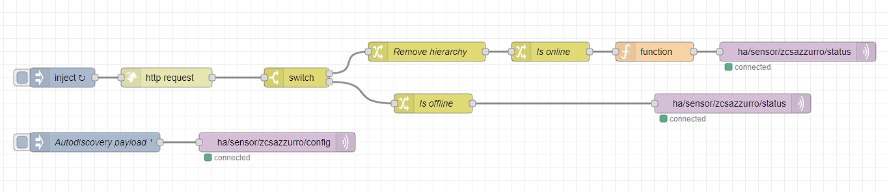

# ZCS Azzurro

This is my Node Red + MQTT configuration for ZCS Azzurro Inverter. Following how the flow has been structured:



## Prerequisites

Following what you need before starting:

- Home Assistant
- Node Red
- MQTT broker

## How to

1. Download nodered-flow.json
2. Open it and replace the following string:
  - "Zcs YYYYYYY" with the key provided by ZCS
  - "ZMXXXXXXXXXXXX" with the serial number placed on the side of the inverter
3. Import the flow in your node red instance: top-right menu --> Import --> Follow instruction
4. Customize the MQTT connection adding your credential: open one of the MQTT node and click on the pencil icon at the end of the "Server" field
5. Deploy the flow and HA should automatically recognize the entity. The entity has as value the lastUpdate received from the API
6. Open the config configuration.yaml and add the following template in order to format correctly the value:

```
##### current
template:
  - sensor:
      - name: "Potenza Istantanea"
        unit_of_measurement: "kWh"
        state: >
          {{ state_attr('sensor.zcs_inverter','powerGenerating') if is_number(state_attr('sensor.zcs_inverter','powerGenerating')) else 0.0 | float }}
        state_class: measurement
        device_class: power
        icon: mdi:solar-power

      - name: "Batteria"
        unit_of_measurement: "%"
        state: >
          {{ state_attr('sensor.zcs_inverter','batterySoC') if is_number(state_attr('sensor.zcs_inverter','batterySoC')) else 0 | int }}
        state_class: measurement
        device_class: power_factor
        icon: mdi:battery-90

      - name: "Consumo Giorno Casa"
        unit_of_measurement: "kWh"
        state: >
          {{ state_attr('sensor.zcs_inverter','energyConsuming') if is_number(state_attr('sensor.zcs_inverter','energyConsuming')) else 0.0 | float }}
        state_class: measurement
        device_class: energy
        icon: mdi:power-socket-it

      - name: "Autoconsum Giorno"
        unit_of_measurement: "kWh"
        state: >
          {{ state_attr('sensor.zcs_inverter','energyAutoconsuming') if is_number(state_attr('sensor.zcs_inverter','energyAutoconsuming')) else 0.0 | float }}
        state_class: measurement
        device_class: energy
        icon: mdi:power-plug-outline

      - name: "Scarica"
        unit_of_measurement: "kWh"
        state: >
          {{ state_attr('sensor.zcs_inverter','energyDischarging') if is_number(state_attr('sensor.zcs_inverter','energyDischarging')) else 0.0 | float }}
        state_class: measurement
        device_class: energy
        icon: mdi:battery-low

      - name: "Carica"
        unit_of_measurement: "kWh"
        state: >
          {{ state_attr('sensor.zcs_inverter','energyCharging') if is_number(state_attr('sensor.zcs_inverter','energyCharging')) else 0.0 | float }}
        state_class: measurement
        device_class: energy
        icon: mdi:battery-high

      - name: "Produzione"
        unit_of_measurement: "kWh"
        state: >
          {{ state_attr('sensor.zcs_inverter','energyGenerating') if is_number(state_attr('sensor.zcs_inverter','energyGenerating')) else 0.0 | float }}
        state_class: measurement
        device_class: energy
        icon: mdi:solar-power

      - name: "Prelievo"
        unit_of_measurement: "kWh"
        state: >
          {{ state_attr('sensor.zcs_inverter','energyImporting') if is_number(state_attr('sensor.zcs_inverter','energyImporting')) else 0.0 | float }}
        state_class: measurement
        device_class: energy
        icon: mdi:transmission-tower

      - name: "Immissione"
        unit_of_measurement: "kWh"
        state: >
          {{ state_attr('sensor.zcs_inverter','energyExporting') if is_number(state_attr('sensor.zcs_inverter','energyExporting')) else 0.0 | float }}
        state_class: measurement
        device_class: energy
        icon: mdi:solar-power

##### total
      - name: "Produzione Totale"
        unit_of_measurement: "kWh"
        state: >
          {{ state_attr('sensor.zcs_inverter','energyGeneratingTotal') if is_number(state_attr('sensor.zcs_inverter','energyGeneratingTotal')) else 0.0 | float }}
        state_class: total_increasing
        device_class: energy
        icon: mdi:weather-sunny

      - name: "Prelievo Totale"
        unit_of_measurement: "kWh"
        state: >
          {{ state_attr('sensor.zcs_inverter','energyImportingTotal') if is_number(state_attr('sensor.zcs_inverter','energyImportingTotal')) else 0.0 | float }}
        state_class: total_increasing
        device_class: energy
        icon: mdi:transmission-tower

      - name: "Immissione Totale"
        unit_of_measurement: "kWh"
        state: >
          {{ state_attr('sensor.zcs_inverter','energyExportingTotal') if is_number(state_attr('sensor.zcs_inverter','energyExportingTotal')) else 0.0 | float }}
        state_class: total_increasing
        device_class: energy
        icon: mdi:flash-circle

      - name: "Autoconsum Totale"
        unit_of_measurement: "kWh"
        state: >
          {{ state_attr('sensor.zcs_inverter','energyAutoconsumingTotal') if is_number(state_attr('sensor.zcs_inverter','energyAutoconsumingTotal')) else 0.0 | float }}
        state_class: total_increasing
        device_class: energy
        icon: mdi:power-plug-outline

      - name: "Scarica Totale"
        unit_of_measurement: "kWh"
        state: >
          {{ state_attr('sensor.zcs_inverter','energyDischargingTotal') if is_number(state_attr('sensor.zcs_inverter','energyDischargingTotal')) else 0.0 | float }}
        state_class: total_increasing
        device_class: energy
        icon: mdi:battery-low

      - name: "Carica Totale"
        unit_of_measurement: "kWh"
        state: >
          {{ state_attr('sensor.zcs_inverter','energyChargingTotal') if is_number(state_attr('sensor.zcs_inverter','energyChargingTotal')) else 0.0 | float }}
        state_class: total_increasing
        device_class: energy
        icon: mdi:battery-high
```

# Credits

Big thanks to [@SDeSalve](https://github.com/sdesalve) and his amazing work.
